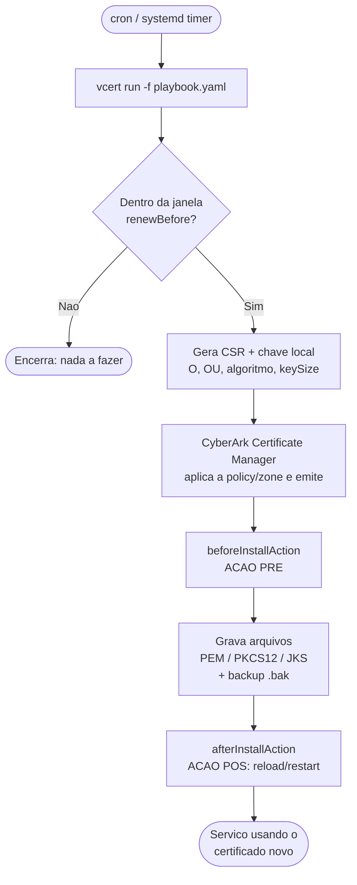

# vcert-examples

Exemplos práticos e boas práticas de uso do **VCERT** com o **CyberArk Certificate Manager** (antigo Venafi Trust Protection Platform / Venafi as a Service) para automatizar a **emissão**, **instalação** e **renovação** de certificados TLS em Linux.

O foco deste repositório é o modelo de **playbook** do VCERT (`vcert run -f playbook.yaml`), que cobre todo o ciclo de vida do certificado de forma declarativa: geração de CSR, instalação dos arquivos e execução de ações de **pré** e **pós** renovação (ex.: parar/recarregar serviços).

> ⚠️ **Aviso:** Os exemplos usam valores fictícios (`suaempresa.com.br`, caminhos, URLs). Ajuste para o seu ambiente. **Nunca** faça commit de tokens, senhas ou chaves privadas.

---

## Índice

- [O que é o VCERT](#o-que-é-o-vcert)
- [Como funciona (diagrama)](#como-funciona-diagrama)
- [Pré-requisitos](#pré-requisitos)
- [Instalação rápida](#instalação-rápida)
- [Início rápido (Quickstart)](#início-rápido-quickstart)
- [Estrutura do repositório](#estrutura-do-repositório)
- [Exemplos disponíveis](#exemplos-disponíveis)
- [Documentação](#documentação)
- [Boas práticas](#boas-práticas)
- [Segurança](#segurança)
- [Contribuindo](#contribuindo)
- [Licença](#licença)

---

## O que é o VCERT

O [VCERT](https://github.com/Venafi/vcert) é a ferramenta de linha de comando (e biblioteca Go) usada para integrar máquinas e pipelines ao CyberArk Certificate Manager. Com ele você consegue:

- **Solicitar / inscrever (enroll)** certificados.
- **Renovar** certificados existentes automaticamente.
- **Recuperar (pickup)** certificados emitidos.
- **Revogar** certificados.
- Rodar **playbooks** que orquestram o ciclo de vida completo, incluindo a instalação dos arquivos e hooks de pré/pós ação.

---

## Como funciona (diagrama)



Mais diagramas (componentes e por serviço) em [`docs/architecture.md`](docs/architecture.md).

---

## Pré-requisitos

- Linux (Debian/Ubuntu e RHEL/Rocky) **ou Windows Server** (para IIS — veja [`docs/windows-iis.md`](docs/windows-iis.md)).
- Binário do `vcert` ([releases](https://github.com/Venafi/vcert/releases)).
- Acesso ao CyberArk Certificate Manager:
  - **Self-Hosted (TPP):** URL do vedsdk + `access token` (ou credenciais para gerá-lo).
  - **SaaS (VaaS):** URL da API + `API key`.
- Uma **policy folder / zone** (Self-Hosted) ou **Application + Issuing Template** (SaaS) onde você tenha permissão para emitir.

---

## Instalação rápida

```bash
# Baixe o binário correspondente à sua arquitetura em:
#   https://github.com/Venafi/vcert/releases
# Exemplo (Linux x86_64):
curl -L -o vcert.zip https://github.com/Venafi/vcert/releases/latest/download/vcert_linux.zip
unzip vcert.zip
chmod +x vcert
sudo mv vcert /usr/local/bin/vcert
vcert --version
```

Veja o passo a passo completo em [`docs/installation.md`](docs/installation.md).

---

## Início rápido (Quickstart)

1. **Autentique-se** e gere um token (Self-Hosted):

   ```bash
   vcert getcred \
     --username SEU_USUARIO \
     --password 'SUA_SENHA' \
     -u https://tpp.suaempresa.com.br/vedsdk \
     --client-id vcert-cli
   ```

2. **Exporte o token** como variável de ambiente (o playbook o lê de lá):

   ```bash
   export VCERT_TOKEN="cole_o_access_token_aqui"
   ```

3. **Edite** um dos playbooks em [`playbooks/`](playbooks/) com os dados do seu certificado.

4. **Valide** a sintaxe e **execute**:

   ```bash
   vcert run -f playbooks/tpp-selfhosted.yaml --validate
   vcert run -f playbooks/tpp-selfhosted.yaml
   ```

5. **Automatize** a renovação com [cron](cron/) ou [systemd timer](systemd/).

---

## Estrutura do repositório

```
vcert-examples/
├── README.md                      # este arquivo
├── LICENSE                        # MIT
├── CONTRIBUTING.md                # como contribuir
├── SECURITY.md                    # política de segurança e como reportar
├── CHANGELOG.md                   # histórico de mudanças
├── .gitignore                     # ignora segredos e artefatos
├── docs/
│   ├── installation.md            # instalação do vcert
│   ├── authentication.md          # autenticação (TPP token / SaaS API key)
│   ├── playbook-reference.md      # referência dos campos do playbook
│   ├── architecture.md            # diagramas de fluxo e por serviço
│   ├── windows-iis.md             # guia Windows / IIS (CAPI + bind)
│   ├── revocation.md              # revogação de certificados
│   └── best-practices.md          # boas práticas detalhadas
├── playbooks/
│   ├── tpp-selfhosted.yaml        # exemplo completo Self-Hosted (TPP)
│   ├── saas-vaas.yaml             # exemplo SaaS (VaaS)
│   ├── multi-format.yaml          # PEM + PKCS12 + JKS no mesmo certificado
│   ├── haproxy.yaml               # HAProxy
│   ├── apache.yaml                # Apache (httpd)
│   ├── nginx.yaml                 # Nginx
│   ├── tomcat.yaml                # Tomcat (PKCS#12)
│   ├── windows-iis.yaml           # Windows / IIS (CAPI)
│   ├── azure-appgw.yaml           # Azure Application Gateway
│   └── aws-acm.yaml               # AWS ALB/NLB (ACM)
├── systemd/
│   ├── vcert.service              # unit de serviço (oneshot)
│   └── vcert.timer                # timer para renovação periódica
├── cron/
│   └── vcert-cron.example         # entrada de crontab de exemplo
└── scripts/
    ├── pre-renew.sh               # hook pré-renovação (genérico)
    ├── post-renew.sh              # hook pós-renovação (genérico)
    ├── post-renew-haproxy.sh      # hook pós-renovação para HAProxy
    ├── post-renew-apache.sh       # hook pós-renovação para Apache
    ├── post-renew-nginx.sh        # hook pós-renovação para Nginx
    ├── post-renew-tomcat.sh       # hook pós-renovação para Tomcat
    ├── post-renew-iis.ps1         # hook pós-renovação para Windows/IIS
    ├── post-renew-azure-appgw.sh  # hook pós-renovação para Azure App Gateway
    ├── post-renew-aws-acm.sh      # hook pós-renovação para AWS ACM
    └── revoke.sh                  # wrapper para vcert revoke
```

---

## Exemplos disponíveis

| Arquivo | Cenário |
|---|---|
| [`playbooks/tpp-selfhosted.yaml`](playbooks/tpp-selfhosted.yaml) | CyberArk Certificate Manager Self-Hosted (TPP) com access token, CSR local, hooks pré/pós. |
| [`playbooks/saas-vaas.yaml`](playbooks/saas-vaas.yaml) | CyberArk Certificate Manager SaaS (VaaS) com API key. |
| [`playbooks/multi-format.yaml`](playbooks/multi-format.yaml) | Mesma emissão gravada em PEM, PKCS#12 e JKS para apps diferentes. |
| [`playbooks/haproxy.yaml`](playbooks/haproxy.yaml) | **HAProxy** — gera PEM único (cert+chain+key) e faz `reload`. |
| [`playbooks/apache.yaml`](playbooks/apache.yaml) | **Apache (httpd)** — PEM separados e `graceful reload`. |
| [`playbooks/nginx.yaml`](playbooks/nginx.yaml) | **Nginx** — monta fullchain (cert+chain) e faz `reload`. |
| [`playbooks/tomcat.yaml`](playbooks/tomcat.yaml) | **Tomcat** — keystore PKCS#12 e `restart`. |
| [`playbooks/windows-iis.yaml`](playbooks/windows-iis.yaml) | **Windows / IIS** — store CAPI + bind automático no IIS via PowerShell. |
| [`playbooks/azure-appgw.yaml`](playbooks/azure-appgw.yaml) | **Azure Application Gateway** — emite .pfx e envia via Azure CLI. |
| [`playbooks/aws-acm.yaml`](playbooks/aws-acm.yaml) | **AWS ALB/NLB** — importa no ACM (reusa o ARN) via AWS CLI. |
| [`docs/revocation.md`](docs/revocation.md) | **Revogação** de certificados (`vcert revoke`) + `scripts/revoke.sh`. |
| [`systemd/`](systemd/) | Renovação agendada via systemd timer (Linux). |
| [`cron/`](cron/) | Renovação agendada via cron (Linux). |
| [`scripts/`](scripts/) | Scripts de hook de pré e pós renovação (Linux `.sh` e Windows `.ps1`). |

---

## Documentação

- [Instalação](docs/installation.md)
- [Autenticação](docs/authentication.md)
- [Referência do playbook](docs/playbook-reference.md)
- [Arquitetura e diagramas](docs/architecture.md)
- [Windows / IIS](docs/windows-iis.md)
- [Revogação](docs/revocation.md)
- [Boas práticas](docs/best-practices.md)

---

## Boas práticas

Resumo (detalhes em [`docs/best-practices.md`](docs/best-practices.md)):

- **Nunca** versione tokens, senhas ou chaves. Use variáveis de ambiente (`{{ Env "VCERT_TOKEN" }}`) ou um cofre.
- Prefira **CSR local** (`csr: local`) para que a chave privada nunca saia da máquina.
- Defina `renewBefore` com folga (ex.: 30 dias) e rode a automação **com frequência** (cron/timer a cada 12h).
- Sempre use `--validate` em mudanças antes de aplicar.
- Restrinja permissões dos arquivos de chave (`chmod 600`, dono do serviço).
- Habilite `backupFiles: true` para conseguir reverter rápido.
- Teste os hooks de pós-renovação garantindo que o serviço **recarrega** o certificado novo.
- Centralize as políticas (validade, algoritmo, tamanho de chave) na **zone** do servidor.

---

## Segurança

Encontrou uma vulnerabilidade ou exposição de segredo? Veja [`SECURITY.md`](SECURITY.md). **Não** abra issue pública com detalhes sensíveis.

---

## Contribuindo

Contribuições são bem-vindas! Leia [`CONTRIBUTING.md`](CONTRIBUTING.md) antes de abrir um PR.

---

## Licença

Distribuído sob a licença **MIT**. Veja [`LICENSE`](LICENSE).

> Este projeto é **não-oficial** e não é mantido pela CyberArk/Palo Alto Networks. "VCERT", "CyberArk" e "Palo Alto Networks" são marcas de seus respectivos donos.
