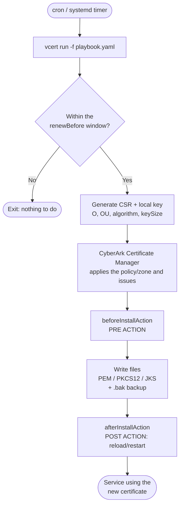

# vcert-examples

Practical examples and best practices for using **VCERT** with the **CyberArk Certificate Manager** (formerly Venafi Trust Protection Platform / Venafi as a Service) to automate the **enrollment**, **installation**, and **renewal** of TLS certificates on Linux and Windows.

This repository focuses on the VCERT **playbook** model (`vcert run -f playbook.yaml`), which covers the full certificate lifecycle declaratively: CSR generation, file installation, and **pre** and **post** renewal actions (e.g., stopping/reloading services).

> ⚠️ **Notice:** The examples use placeholder values (`yourcompany.com`, paths, URLs). Adapt them to your environment. **Never** commit tokens, passwords, or private keys.

---

## Table of Contents

- [How it works (diagram)](#how-it-works-diagram)
- [Prerequisites](#prerequisites)
- [Quick install](#quick-install)
- [Quickstart](#quickstart)
- [Repository structure](#repository-structure)
- [Available examples](#available-examples)
- [Documentation](#documentation)
- [Best practices](#best-practices)
- [Security](#security)
- [Contributing](#contributing)
- [License](#license)

---

## What is VCERT

[VCERT](https://github.com/Venafi/vcert) is the command-line tool (and Go library) used to integrate machines and pipelines with the CyberArk Certificate Manager. With it you can:

- **Request / enroll** certificates.
- **Renew** existing certificates automatically.
- **Pick up (retrieve)** issued certificates.
- **Revoke** certificates.
- Run **playbooks** that orchestrate the full lifecycle, including file installation and pre/post action hooks.

---

## How it works (diagram)



More diagrams (components and per-service) in [`docs/architecture.md`](docs/architecture.md).

---

## Prerequisites

- Linux (Debian/Ubuntu and RHEL/Rocky) **or Windows Server** (for IIS — see [`docs/windows-iis.md`](docs/windows-iis.md)).
- The `vcert` binary ([releases](https://github.com/Venafi/vcert/releases)).
- Access to the CyberArk Certificate Manager:
  - **Self-Hosted (TPP):** vedsdk URL + `access token` (or credentials to generate one).
  - **SaaS (VaaS):** API URL + `API key`.
- A **policy folder / zone** (Self-Hosted) or **Application + Issuing Template** (SaaS) where you have permission to issue.

---

## Quick install

```bash
# Download the binary for your architecture from:
#   https://github.com/Venafi/vcert/releases
# Example (Linux x86_64):
curl -L -o vcert.zip https://github.com/Venafi/vcert/releases/latest/download/vcert_linux.zip
unzip vcert.zip
chmod +x vcert
sudo mv vcert /usr/local/bin/vcert
vcert --version
```

See the full walkthrough in [`docs/installation.md`](docs/installation.md).

---

## Quickstart

1. **Authenticate** and generate a token (Self-Hosted):

   ```bash
   vcert getcred \
     --username YOUR_USER \
     --password 'YOUR_PASSWORD' \
     -u https://tpp.yourcompany.com/vedsdk \
     --client-id vcert-cli
   ```

2. **Export the token** as an environment variable (the playbook reads it from there):

   ```bash
   export VCERT_TOKEN="paste_the_access_token_here"
   ```

3. **Edit** one of the playbooks in [`playbooks/`](playbooks/) with your certificate details.

4. **Validate** the syntax and **run**:

   ```bash
   vcert run -f playbooks/tpp-selfhosted.yaml --validate
   vcert run -f playbooks/tpp-selfhosted.yaml
   ```

5. **Automate** the renewal with [cron](cron/) or a [systemd timer](systemd/).

---

## Repository structure

```
vcert-examples/
├── README.md                      # this file
├── LICENSE                        # MIT
├── CONTRIBUTING.md                # how to contribute
├── SECURITY.md                    # security policy and how to report
├── CHANGELOG.md                   # change history
├── .gitignore                     # ignores secrets and artifacts
├── docs/
│   ├── installation.md            # installing vcert
│   ├── authentication.md          # authentication (TPP token / SaaS API key)
│   ├── playbook-reference.md      # playbook field reference
│   ├── architecture.md            # flow and per-service diagrams
│   ├── windows-iis.md             # Windows / IIS guide (CAPI + binding)
│   ├── revocation.md              # certificate revocation
│   └── best-practices.md          # detailed best practices
├── playbooks/
│   ├── tpp-selfhosted.yaml        # full Self-Hosted (TPP) example
│   ├── saas-vaas.yaml             # SaaS (VaaS) example
│   ├── multi-format.yaml          # PEM + PKCS12 + JKS for the same certificate
│   ├── haproxy.yaml               # HAProxy
│   ├── apache.yaml                # Apache (httpd)
│   ├── nginx.yaml                 # Nginx
│   ├── tomcat.yaml                # Tomcat (PKCS#12)
│   ├── windows-iis.yaml           # Windows / IIS (CAPI)
│   ├── azure-appgw.yaml           # Azure Application Gateway
│   └── aws-acm.yaml               # AWS ALB/NLB (ACM)
├── systemd/
│   ├── vcert.service              # service unit (oneshot)
│   └── vcert.timer                # timer for periodic renewal
├── cron/
│   └── vcert-cron.example         # example crontab entry
└── scripts/
    ├── pre-renew.sh               # pre-renewal hook (generic)
    ├── post-renew.sh              # post-renewal hook (generic)
    ├── post-renew-haproxy.sh      # post-renewal hook for HAProxy
    ├── post-renew-apache.sh       # post-renewal hook for Apache
    ├── post-renew-nginx.sh        # post-renewal hook for Nginx
    ├── post-renew-tomcat.sh       # post-renewal hook for Tomcat
    ├── post-renew-iis.ps1         # post-renewal hook for Windows/IIS
    ├── post-renew-azure-appgw.sh  # post-renewal hook for Azure App Gateway
    ├── post-renew-aws-acm.sh      # post-renewal hook for AWS ACM
    └── revoke.sh                  # wrapper for vcert revoke
```

---

## Available examples

| File | Scenario |
|---|---|
| [`playbooks/tpp-selfhosted.yaml`](playbooks/tpp-selfhosted.yaml) | CyberArk Certificate Manager Self-Hosted (TPP) with access token, local CSR, pre/post hooks. |
| [`playbooks/saas-vaas.yaml`](playbooks/saas-vaas.yaml) | CyberArk Certificate Manager SaaS (VaaS) with API key. |
| [`playbooks/multi-format.yaml`](playbooks/multi-format.yaml) | Same issuance written as PEM, PKCS#12, and JKS for different apps. |
| [`playbooks/haproxy.yaml`](playbooks/haproxy.yaml) | **HAProxy** — builds a single PEM (cert+chain+key) and runs `reload`. |
| [`playbooks/apache.yaml`](playbooks/apache.yaml) | **Apache (httpd)** — separate PEM files and `graceful reload`. |
| [`playbooks/nginx.yaml`](playbooks/nginx.yaml) | **Nginx** — builds the fullchain (cert+chain) and runs `reload`. |
| [`playbooks/tomcat.yaml`](playbooks/tomcat.yaml) | **Tomcat** — PKCS#12 keystore and `restart`. |
| [`playbooks/windows-iis.yaml`](playbooks/windows-iis.yaml) | **Windows / IIS** — CAPI store + automatic IIS binding via PowerShell. |
| [`playbooks/azure-appgw.yaml`](playbooks/azure-appgw.yaml) | **Azure Application Gateway** — issues a .pfx and uploads via Azure CLI. |
| [`playbooks/aws-acm.yaml`](playbooks/aws-acm.yaml) | **AWS ALB/NLB** — imports into ACM (reusing the ARN) via AWS CLI. |
| [`docs/revocation.md`](docs/revocation.md) | **Revocation** of certificates (`vcert revoke`) + `scripts/revoke.sh`. |
| [`systemd/`](systemd/) | Renewal scheduled via systemd timer (Linux). |
| [`cron/`](cron/) | Renewal scheduled via cron (Linux). |
| [`scripts/`](scripts/) | Pre/post renewal hook scripts (Linux `.sh` and Windows `.ps1`). |

---

## Documentation

- [Installation](docs/installation.md)
- [Authentication](docs/authentication.md)
- [Playbook reference](docs/playbook-reference.md)
- [Architecture and diagrams](docs/architecture.md)
- [Windows / IIS](docs/windows-iis.md)
- [Revocation](docs/revocation.md)
- [Best practices](docs/best-practices.md)

---

## Best practices

Summary (details in [`docs/best-practices.md`](docs/best-practices.md)):

- **Never** version tokens, passwords, or keys. Use environment variables (`{{ Env "VCERT_TOKEN" }}`) or a vault.
- Prefer **local CSR** (`csr: local`) so the private key never leaves the machine.
- Set `renewBefore` with margin (e.g., 30 days) and run the automation **frequently** (cron/timer every 12h).
- Always use `--validate` on changes before applying.
- Restrict key file permissions (`chmod 600`, owned by the service user).
- Enable `backupFiles: true` to roll back quickly.
- Test post-renewal hooks to ensure the service **reloads** the new certificate.
- Centralize policies (validity, algorithm, key size) in the server-side **zone**.

---

## Security

Found a vulnerability or an exposed secret? See [`SECURITY.md`](SECURITY.md). **Do not** open a public issue with sensitive details.

---

## Contributing

Contributions are welcome! Read [`CONTRIBUTING.md`](CONTRIBUTING.md) before opening a PR.

---

## License

Distributed under the **MIT** license. See [`LICENSE`](LICENSE).

> This project is **unofficial** and is not maintained by CyberArk/Palo Alto Networks. "VCERT", "CyberArk", and "Palo Alto Networks" are trademarks of their respective owners.
