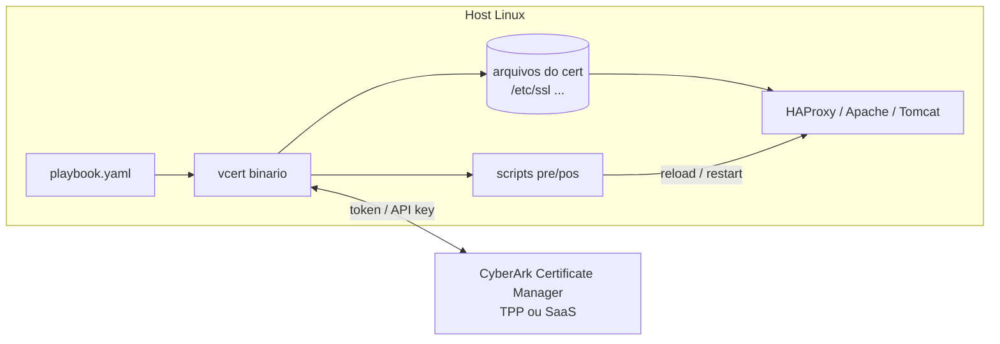
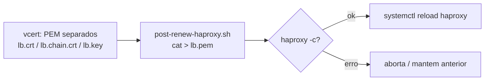
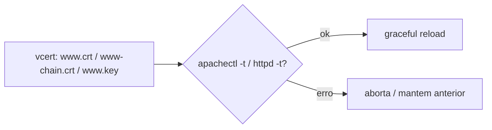
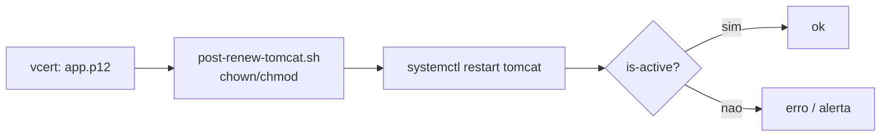
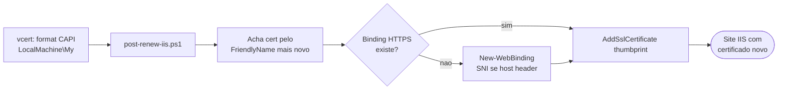
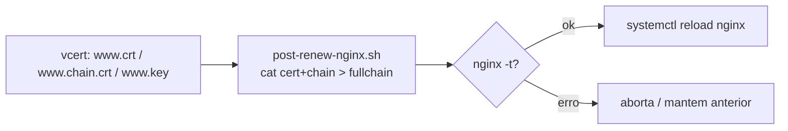
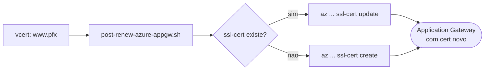
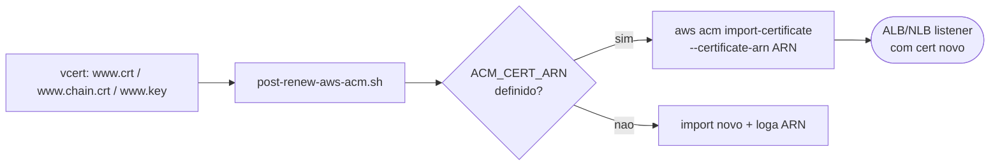

# Arquitetura e Fluxo

Diagramas do funcionamento do VCERT com o CyberArk Certificate Manager. (Renderizados pelo GitHub via Mermaid.)

## Fluxo geral de renovação


## Componentes



## Por serviço

### HAProxy
Espera **um único PEM** = `cert + chain + key`. O `vcert` grava os três separados e o `post-renew-haproxy.sh` concatena e faz `reload` (sem downtime).



### Apache (httpd)
Usa **PEM separados** direto nas diretivas `SSLCertificate*`. O `post-renew-apache.sh` valida (`-t`) e faz `graceful`.



### Tomcat
Usa **keystore PKCS#12** (ou JKS). O `post-renew-tomcat.sh` ajusta permissões e faz `restart` (Tomcat não recarrega keystore a quente).



### Windows / IIS
Instala no **Windows Certificate Store (CAPI)**; o `post-renew-iis.ps1` (PowerShell) faz o **bind** do novo thumbprint no site do IIS — sem reiniciar o serviço.



### Nginx
Usa **fullchain** (cert+chain) em um arquivo e a chave em outro. O `post-renew-nginx.sh` monta o fullchain, valida (`nginx -t`) e faz `reload`.



### Azure Application Gateway
O gateway não lê arquivos locais. O `vcert` emite um **.pfx** e o `post-renew-azure-appgw.sh` envia via **Azure CLI** (`az ... ssl-cert update`).



### AWS ALB / NLB (ACM)
Os LBs da AWS usam certificados do **ACM** por ARN. O `post-renew-aws-acm.sh` faz `import-certificate` reusando o mesmo **ARN** — o listener pega o novo automaticamente.



## Revogação

Ação pontual via CLI (não é parte do playbook). Detalhes em [`revocation.md`](revocation.md).

```mermaid
flowchart LR
    A[vcert revoke] --> B{Seletor}
    B -- --id DN --> C[CyberArk Certificate Manager]
    B -- --thumbprint SHA1 --> C
    C --> D{--no-retire?}
    D -- sim --> E([Revogado, objeto<br/>reemitivel])
    D -- nao --> F([Revogado + desabilitado])
```
