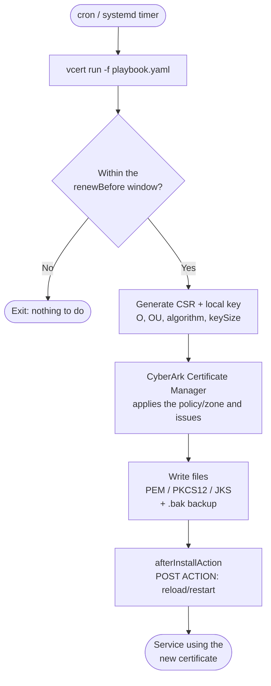
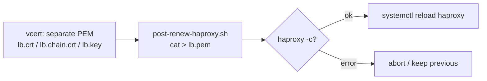
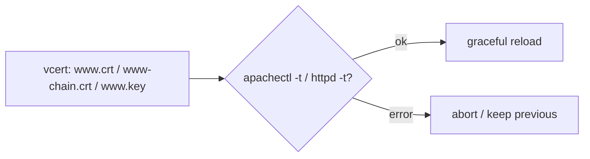
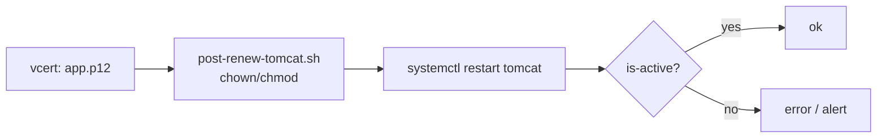
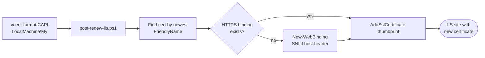
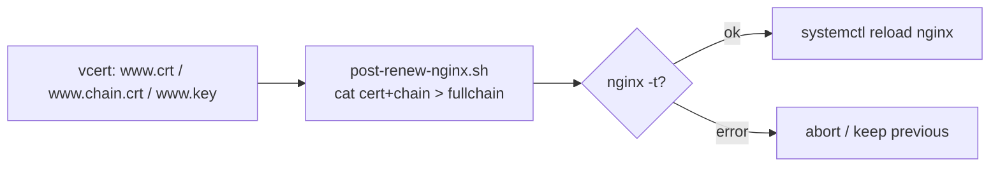
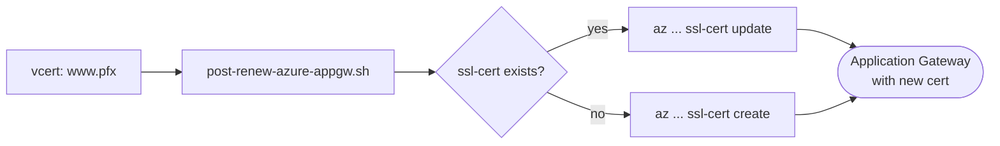
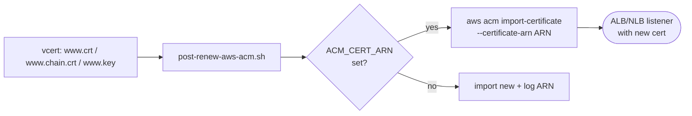
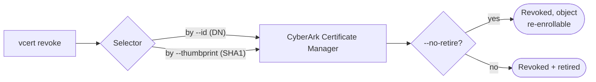

# Architecture and Flow

Diagrams of how VCERT works with the CyberArk Certificate Manager. (Rendered by GitHub via Mermaid.)

## General renewal flow

> The playbook has no native pre-install hook. Optional PRE steps run from a wrapper around `vcert run` (see [`../scripts/vcert-run.sh`](../scripts/vcert-run.sh)); only `afterInstallAction` (POST) is supported by the playbook.

## Components

## Per service

### HAProxy
Expects a **single PEM** = `cert + chain + key`. VCERT writes the three separately and `post-renew-haproxy.sh` concatenates them and runs `reload` (no downtime).

### Apache (httpd)
Uses **separate PEM files** directly in the `SSLCertificate*` directives. `post-renew-apache.sh` validates (`-t`) and runs `graceful`.

### Tomcat
Uses a **PKCS#12 keystore** (or JKS). `post-renew-tomcat.sh` fixes permissions and runs `restart` (Tomcat does not hot-reload the keystore).

### Windows / IIS
Installs into the **Windows Certificate Store (CAPI)**; `post-renew-iis.ps1` (PowerShell) **binds** the new thumbprint to the IIS site — without restarting the service.

### Nginx
Uses a **fullchain** (cert+chain) in one file and the key in another. `post-renew-nginx.sh` builds the fullchain, validates (`nginx -t`), and runs `reload`.

### Azure Application Gateway
The gateway does not read local files. VCERT issues a **.pfx** and `post-renew-azure-appgw.sh` uploads it via the **Azure CLI** (`az ... ssl-cert update`).

### AWS ALB / NLB (ACM)
AWS LBs use **ACM** certificates by ARN. `post-renew-aws-acm.sh` runs `import-certificate` reusing the same **ARN** — the listener picks up the new one automatically.

## Revocation

A one-off CLI action (not part of the playbook). Details in [`revocation.md`](revocation.md).

