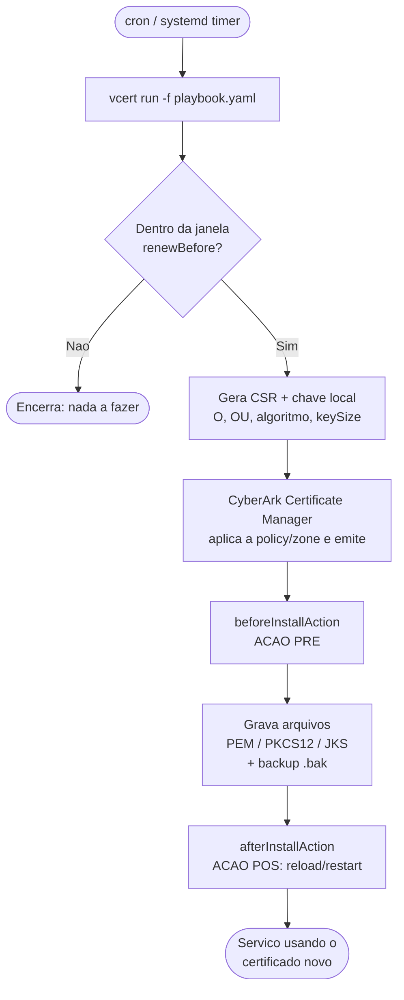
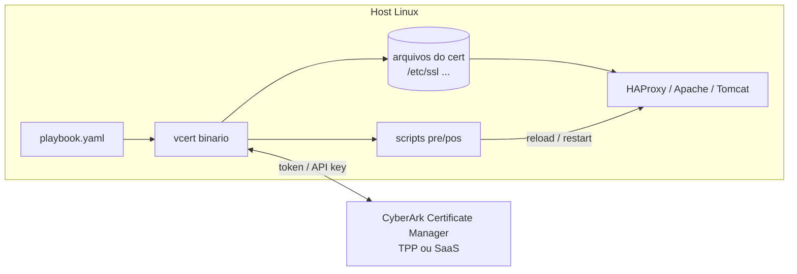
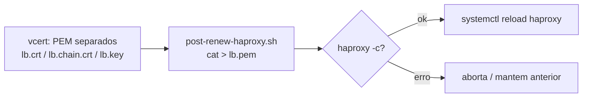
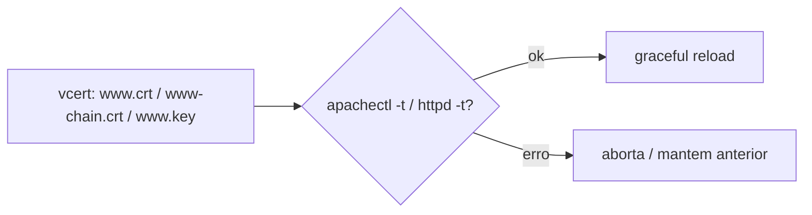
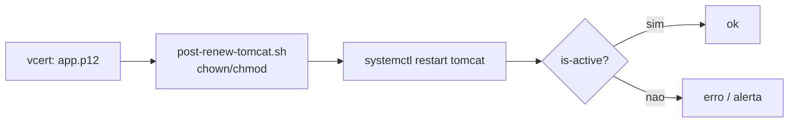

# Arquitetura e Fluxo

Diagramas do funcionamento do VCERT com o CyberArk Certificate Manager. (Renderizados pelo GitHub via Mermaid.)

## Fluxo geral de renovação

## Componentes

## Por serviço

### HAProxy
Espera **um único PEM** = `cert + chain + key`. O `vcert` grava os três separados e o `post-renew-haproxy.sh` concatena e faz `reload` (sem downtime).

### Apache (httpd)
Usa **PEM separados** direto nas diretivas `SSLCertificate*`. O `post-renew-apache.sh` valida (`-t`) e faz `graceful`.

### Tomcat
Usa **keystore PKCS#12** (ou JKS). O `post-renew-tomcat.sh` ajusta permissões e faz `restart` (Tomcat não recarrega keystore a quente).

